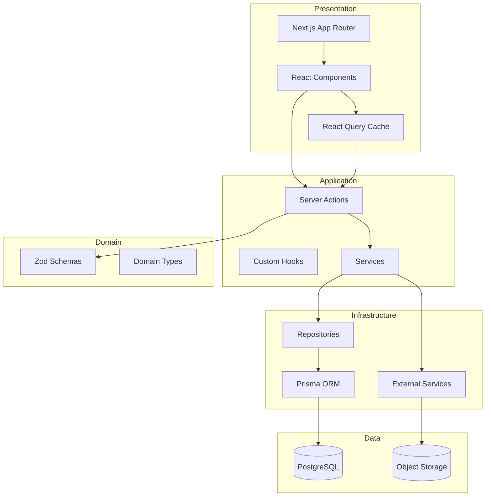

# Architecture

## Overview

Legal CRM follows **Clean Architecture** with a **feature-first** folder structure. The system is designed as a multi-tenant SaaS platform where each law firm (Organization) has isolated data.

## Architecture Diagram



## Layer Responsibilities

### Presentation Layer
- **Location**: `src/app/`, `src/components/`, `src/features/*/ui/`
- **Responsibility**: Rendering UI, user interaction, client-side cache
- **Rules**: No business logic, no direct DB access

### Application Layer
- **Location**: `src/features/*/actions/`, `src/features/*/hooks/`, `src/services/`
- **Responsibility**: Orchestrate use cases, validate input, coordinate repositories
- **Rules**: All mutations via Server Actions; validate with Zod

### Domain Layer
- **Location**: `src/features/*/schemas/`, `src/features/*/types/`, `src/shared/`
- **Responsibility**: Business rules, type definitions, validation schemas
- **Rules**: Framework-agnostic; no imports from Next.js or Prisma in pure domain code

### Infrastructure Layer
- **Location**: `src/repositories/`, `src/lib/prisma.ts`, `src/services/`
- **Responsibility**: Database access, external API integrations, file storage
- **Rules**: All Prisma calls live in repositories only

## Key Patterns

### Repository Pattern

```typescript
// repositories/case.repository.ts
export class CaseRepository {
  constructor(private db: PrismaClient) {}

  async findById(id: string, orgId: string) {
    return this.db.case.findFirst({
      where: { id, organizationId: orgId, deletedAt: null },
    });
  }
}
```

### Server Actions

```typescript
'use server';
export async function createCase(input: CreateCaseInput): Promise<ActionResult<Case>> {
  const session = await requireAuth();
  const parsed = createCaseSchema.parse(input);
  return caseService.create(parsed, session);
}
```

### Feature Module Structure

```
features/cases/
├── ui/                 # CaseList, CaseDetail, CaseForm
├── actions/            # createCase, updateCase, getCases
├── hooks/              # useCases, useCase
├── schemas/            # createCaseSchema, updateCaseSchema
├── types/              # CaseWithClient, CaseFilters
└── index.ts            # Public exports
```

## Multi-Tenancy

Every tenant-scoped query filters by `organizationId` from the authenticated session. Never trust client-provided organization IDs.

```
Request → Middleware (auth) → Server Action (permission check)
  → Service → Repository (orgId filter) → PostgreSQL
```

## Data Flow

### Read Path (Server Component)
```
Page (RSC) → Repository → Prisma → PostgreSQL → Render
```

### Read Path (Client Component)
```
Component → useQuery → Server Action → Repository → Prisma → Cache
```

### Write Path
```
Form → Server Action → Zod validate → Service → Repository → Prisma
  → Activity Log → revalidatePath → Return ActionResult
```

## Authentication & Authorization

- **Auth.js v5** with secure HTTP-only cookies
- **RBAC**: Role → Permissions matrix
- **Permission format**: `resource:action` (e.g., `cases:read`, `invoices:void`)
- **Middleware** protects `(dashboard)` routes
- **Server Actions** enforce permissions on every mutation

## External Integrations

| Service | Purpose | Phase |
|---------|---------|-------|
| S3/R2 | Document storage | M3 |
| Stripe | Payment processing | M6 |
| OpenAI | AI features | M4+ |
| Resend/SendGrid | Email notifications | M2 |

## Decision Records

| ADR | Decision |
|-----|----------|
| ADR-001 | Server Actions over REST for internal API |
| ADR-002 | Repository Pattern over direct Prisma in actions |
| ADR-003 | Feature-first over layer-first folder structure |
| ADR-004 | cuid() over UUID for primary keys |
| ADR-005 | Dark mode first design system |

## Scalability Considerations

- Connection pooling (PgBouncer) for PostgreSQL
- Cursor-based pagination for large datasets
- React Query stale-while-revalidate for client cache
- Presigned URLs for document access (no proxy through app server)
- Background jobs for email/AI (Phase 3+)
