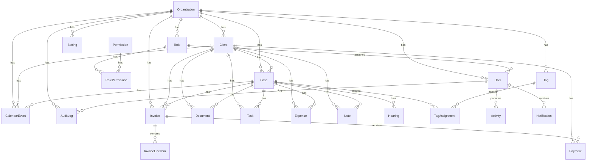

# Database

PostgreSQL database design for Legal CRM. Schema source of truth: `src/prisma/schema.prisma`.

## ERD



## Entity Descriptions

### Organization
Multi-tenant root entity. Every law firm is an Organization with isolated data.

| Field | Type | Notes |
|-------|------|-------|
| slug | String | URL-safe unique identifier |
| timezone | String | Default timezone for calendar/deadlines |
| currency | String | Default billing currency (ISO 4217) |

### User
Firm member with role-based access.

| Field | Type | Notes |
|-------|------|-------|
| status | UserStatus | ACTIVE, INACTIVE, SUSPENDED, PENDING |
| roleId | FK → Role | Determines permissions |
| deletedAt | DateTime? | Soft delete |

### Role & Permission
RBAC system. Permissions use `resource:action` format.

**Default Roles**: Admin, Attorney, Paralegal, Billing, Read-Only

**Default Permissions**: `cases:read`, `cases:create`, `cases:update`, `cases:delete`, `clients:*`, `invoices:*`, `documents:*`, `settings:*`, `ai:use`

### Client
Individual or company receiving legal services.

| Field | Type | Notes |
|-------|------|-------|
| type | ClientType | INDIVIDUAL or COMPANY |
| displayName | String | Computed or entered display name |
| address | Json | Structured address object |
| status | ClientStatus | ACTIVE, INACTIVE, PROSPECT, ARCHIVED |

### Case (Matter)
Central entity linking all case-related data.

| Field | Type | Notes |
|-------|------|-------|
| caseNumber | String | Unique per org: `{PREFIX}-{YEAR}-{SEQ}` |
| status | CaseStatus | OPEN → IN_PROGRESS → CLOSED |
| priority | CasePriority | LOW, MEDIUM, HIGH, URGENT |
| practiceArea | String? | e.g., "Litigation", "Corporate" |

**Business Rules**:
- Cannot close case with open/unpaid invoices
- Case number auto-generated, never reused
- Soft delete with `deletedAt`

### Hearing
Court dates, depositions, mediations linked to cases.

| Field | Type | Notes |
|-------|------|-------|
| type | HearingType | COURT, DEPOSITION, MEDIATION, etc. |
| duration | Int | Minutes |
| status | HearingStatus | SCHEDULED → COMPLETED/CANCELLED |

### Document
Files linked to cases/clients. Metadata in DB, files in object storage.

| Field | Type | Notes |
|-------|------|-------|
| category | DocumentCategory | PLEADING, CONTRACT, EVIDENCE, etc. |
| version | Int | Incremented on re-upload |
| isPrivileged | Boolean | Attorney-client privilege flag |
| fileUrl | String | S3/R2 presigned URL path |

### Task
Deadlines and to-dos linked to cases/clients.

| Field | Type | Notes |
|-------|------|-------|
| status | TaskStatus | TODO → IN_PROGRESS → DONE |
| dueDate | DateTime? | Triggers notifications |

### Invoice
Billable invoices with line items.

| Field | Type | Notes |
|-------|------|-------|
| invoiceNumber | String | Unique per org, sequential |
| status | InvoiceStatus | DRAFT → SENT → PAID |
| subtotal/tax/total | Decimal(12,2) | Financial precision |

**Business Rules**:
- Never hard-delete invoices (use VOID status)
- Cannot edit line items after SENT status
- Tax calculated from org settings

### Payment
Payments against invoices or general client payments.

| Field | Type | Notes |
|-------|------|-------|
| method | PaymentMethod | CASH, CHECK, STRIPE, etc. |
| status | PaymentStatus | PENDING → COMPLETED |

### Expense
Case-related costs.

| Field | Type | Notes |
|-------|------|-------|
| billable | Boolean | Can be added to invoice |
| category | ExpenseCategory | FILING_FEE, TRAVEL, etc. |

### Note
Internal case/client notes. Privileged by default.

| Field | Type | Notes |
|-------|------|-------|
| isPrivileged | Boolean | Default true |
| isPinned | Boolean | Pin to top of notes list |

### Activity
Polymorphic timeline of all actions.

| Field | Type | Notes |
|-------|------|-------|
| entityType | EntityType | CLIENT, CASE, INVOICE, etc. |
| entityId | String | Polymorphic FK |
| action | ActivityAction | CREATED, UPDATED, STATUS_CHANGED, etc. |
| metadata | Json? | Additional context |

### Tag & TagAssignment
Flexible tagging for cases and clients.

### CalendarEvent
Firm calendar events, optionally linked to cases/clients.

### Notification
In-app notifications for users.

| Field | Type | Notes |
|-------|------|-------|
| type | NotificationType | TASK_DUE, HEARING_REMINDER, etc. |
| isRead | Boolean | Mark as read |

### AuditLog
Compliance trail for sensitive data changes.

| Field | Type | Notes |
|-------|------|-------|
| oldValues/newValues | Json? | Before/after snapshots |
| ipAddress | String? | Request origin |

### Setting
Organization-level configuration key-value store.

## Indexes

All tenant-scoped tables indexed on `(organizationId, status)`.
Foreign keys indexed. Partial indexes on `deletedAt IS NULL` where soft delete used.

## Migration Workflow

```bash
# Create migration after schema change
pnpm prisma migrate dev --name descriptive_name

# Apply in production (CI)
pnpm prisma migrate deploy

# Generate client after schema change
pnpm prisma generate

# Seed development data
pnpm prisma db seed
```

## Seed Data

Development seed includes:
- 1 Organization ("Demo Law Firm")
- 5 Roles with permissions
- 3 Users (admin, attorney, paralegal)
- 10 Clients, 20 Cases, sample tasks/invoices

## Data Integrity Rules

| Rule | Enforcement |
|------|-------------|
| Multi-tenant isolation | organizationId filter in repositories |
| Unique case numbers | DB unique constraint per org |
| Unique invoice numbers | DB unique constraint per org |
| No orphan hearings | Cascade delete with case |
| Financial immutability | Status-based edit restrictions in service layer |
| Soft delete | deletedAt on Client, Case, Document, Task, Note, User |
